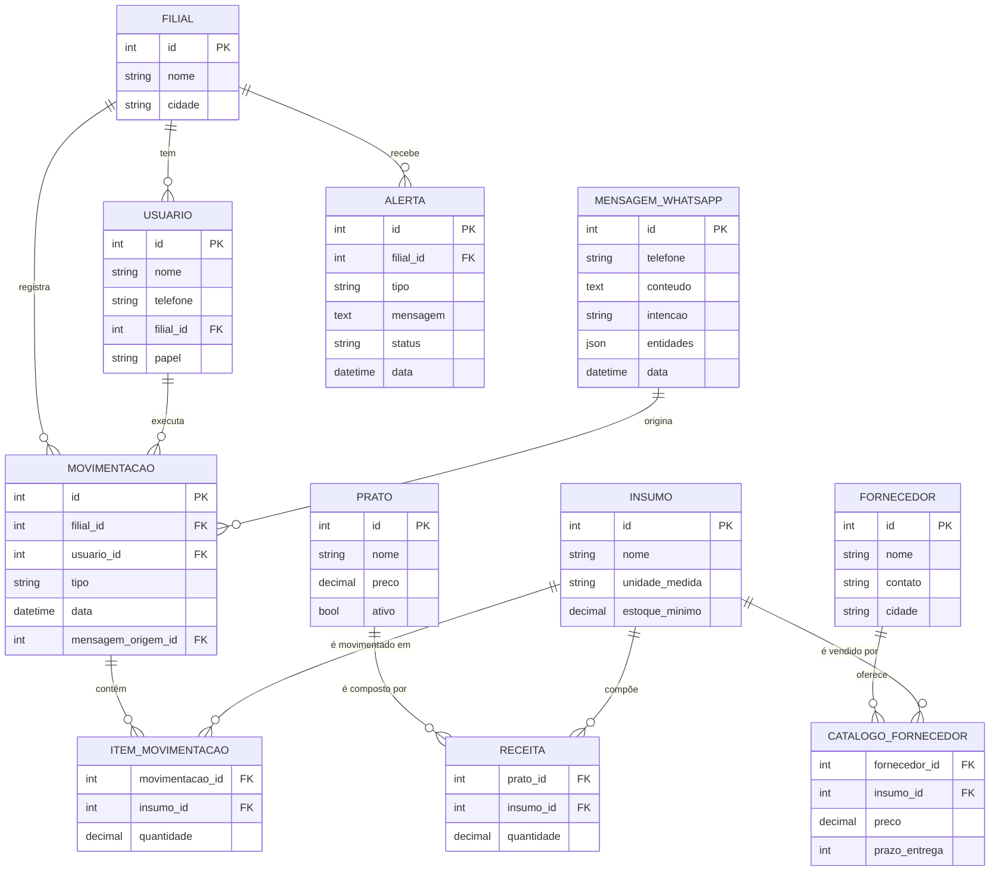

# Desafio Devathon IFCE — Grupo Tereza Gastronomia

## Overview do Problema

O Grupo Tereza é uma rede de gastronomia consolidada e amada no Centro-Sul cearense que cresceu rapidamente, mas cuja **gestão permaneceu no modo manual**. A operação ainda depende de planilhas e conversas de WhatsApp, e toda a coordenação entre filiais, fornecedores e estoque passa por uma única sede.

Esse descompasso entre o tamanho atual da rede e a maturidade da gestão gera quatro gargalos críticos que sufocam a expansão:

1. **Comunicação lenta** — baseada em planilhas e mensagens de WhatsApp dispersas, sem estrutura nem rastreabilidade.
2. **Logística complexa** — múltiplos fornecedores descentralizados, cada filial negociando por conta própria, sem visão consolidada de preços e prazos.
3. **Desperdício de insumos** — falta de análise de dados impede prever consumo e detectar perdas.
4. **Sede sobrecarregada** — uma única pessoa orquestrando toda a operação, sendo o "roteador humano" de toda informação.

Os quatro gargalos são sintomas conectados de uma mesma causa raiz: **a informação operacional é não-estruturada e centralizada na cabeça de uma pessoa**.

---

## Solução Proposta: Tereza IA

Um copiloto de gestão que combina um **agente de IA conversacional no WhatsApp** (canal que as filiais já usam) com um **painel de comando centralizado** para a sede.

A premissa é contra-intuitiva: em vez de substituir o WhatsApp, a solução o torna inteligente. As filiais continuam mandando mensagens em linguagem natural; a IA estrutura, valida e armazena tudo automaticamente, alimentando previsões, alertas e um dashboard em tempo real.

---

## Solução por Gargalo

### 1. Comunicação lenta baseada em planilhas e WhatsApp

**Solução:** Agente de IA no WhatsApp que entende linguagem natural.

As filiais conversam normalmente — *"recebi 18kg de farinha"*, *"acabou o queijo coalho"*, *"vendemos 80 pratos hoje"* — e a IA extrai as entidades (insumo, quantidade, intenção), valida e grava no banco automaticamente.

- Zero fricção: usa o canal e o hábito que já existem.
- Zero treinamento: ninguém precisa aprender app novo.
- Estrutura instantânea: o que era texto solto vira dado consultável.
- Auditoria completa: toda mensagem fica registrada, com a interpretação da IA rastreável.

### 2. Logística complexa com múltiplos fornecedores descentralizados

**Solução:** Marketplace interno de fornecedores integrado ao sistema.

Cada filial passa a enxergar, em um só lugar, o catálogo consolidado de fornecedores — preço atual, prazo de entrega, pedido mínimo, avaliação. A IA sugere automaticamente o melhor fornecedor por insumo, considerando histórico de confiabilidade.

- Filiais disparam pedidos diretamente, sem precisar consultar a sede.
- Comparação de preços entre fornecedores deixa de depender da memória de uma pessoa.
- Histórico de pedidos e entregas alimenta a avaliação contínua dos fornecedores.
- A sede mantém a aprovação final como controle, mas deixa de ser o gargalo operacional.

### 3. Desperdício de insumos por falta de análise de dados

**Solução:** Camada de inteligência com previsão de demanda e detecção de anomalias.

Com todas as movimentações de estoque, vendas e receitas estruturadas, a IA passa a oferecer:

- **Previsão de demanda por filial** baseada em histórico, dia da semana, sazonalidade e eventos locais (festas, feriados regionais).
- **Sugestão automática de pedidos** dimensionada pelo consumo previsto e estoque atual.
- **Análise de variância** comparando o consumo real com o consumo esperado pela ficha técnica das receitas — identifica desperdício insumo a insumo.
- **Detecção de anomalias** alertando quando uma filial consome significativamente mais que o padrão para o volume vendido.

### 4. Sede sobrecarregada orquestrando tudo sozinha

**Solução:** Dashboard de comando centralizado + descentralização operacional.

A sede deixa de ser roteadora de informação e passa a ser estrategista:

- **Visão única e em tempo real** de todas as filiais: estoque, rupturas iminentes, pedidos pendentes, ranking de desperdício, performance de fornecedores.
- **Alertas inteligentes** priorizados por severidade — só o que exige atenção humana sobe ao topo.
- **Decisões operacionais delegadas** para as filiais (com a IA como guarda-corpo), liberando a sede para decisões de negócio.
- **Transparência total** sobre cada decisão da IA: o dashboard mostra a mensagem original, a interpretação e a ação tomada.

---

## Mapeamento Resumido

| Gargalo | Solução | Componente |
|---|---|---|
| Comunicação lenta | Agente IA no WhatsApp | NLP + extração de entidades |
| Logística descentralizada | Marketplace interno | Catálogo consolidado + pedidos diretos |
| Desperdício de insumos | Inteligência preditiva | Previsão + variância + anomalia |
| Sede sobrecarregada | Dashboard de comando | Visão única + alertas + delegação |

---

## Modelos de Dados

Versão enxuta, dimensionada pra construir em 8h. O estoque atual de cada insumo é **calculado** a partir das movimentações (não há tabela de estoque persistido).

### Entidades principais

**`Filial`**
- id, nome, cidade

**`Usuario`**
- id, nome, telefone (chave do WhatsApp), filial (FK), papel

**`Insumo`**
- id, nome, unidade_medida, estoque_minimo

**`Prato`**
- id, nome, preco, ativo

**`Fornecedor`**
- id, nome, contato, cidade

**`Movimentacao`** (cabeçalho)
- id, filial (FK), usuario (FK), tipo (entrada/saída/desperdício/ajuste), data, mensagem_origem (FK → MensagemWhatsApp)

**`MensagemWhatsApp`**
- id, telefone, conteudo, intencao, entidades (JSON), data

**`Alerta`**
- id, filial (FK), tipo, mensagem, status, data

### Tabelas de relação (M2M com dados extras)

**`Receita`** — ponte `Prato ↔ Insumo`
- prato (FK), insumo (FK), quantidade

**`CatalogoFornecedor`** — ponte `Fornecedor ↔ Insumo`
- fornecedor (FK), insumo (FK), preco, prazo_entrega

**`ItemMovimentacao`** — ponte `Movimentacao ↔ Insumo`
- movimentacao (FK), insumo (FK), quantidade

### Diagrama ER

### Notas de modelagem

- **Estoque é calculado, não armazenado.** Soma das `ItemMovimentacao` agrupadas por `insumo` e `filial`, com sinal definido pelo `tipo` da `Movimentacao` (entrada soma, saída/desperdício subtrai).
- **Throughs no Django:** `Receita`, `CatalogoFornecedor` e `ItemMovimentacao` são declarados via `through=` em `ManyToManyField` porque carregam dados além das FKs (quantidade, preço, prazo).
- **Auditoria via WhatsApp:** toda `Movimentacao` aponta para a `MensagemWhatsApp` que a originou — rastreabilidade total da decisão da IA.
- **Vendas e previsão de demanda foram cortadas do MVP.** A previsão pode ser feita a partir do histórico de movimentações de saída (média móvel por dia da semana), sem precisar de tabela separada de vendas.
